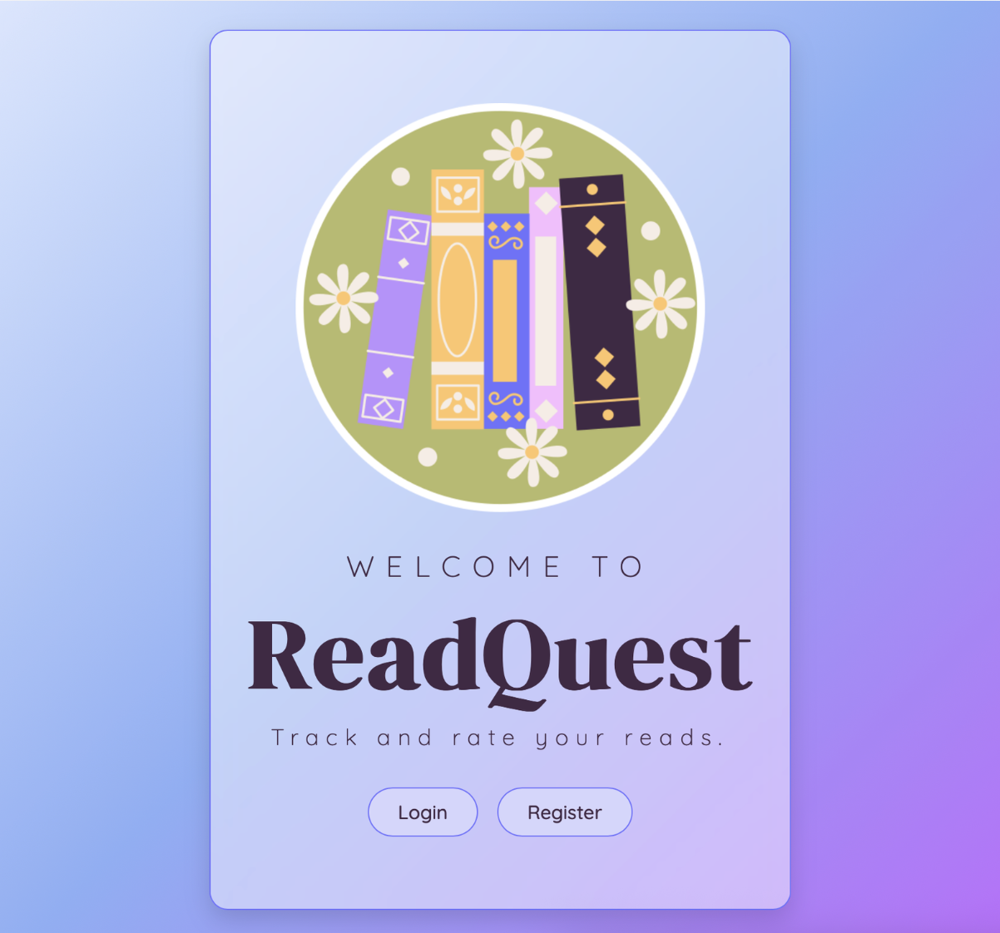
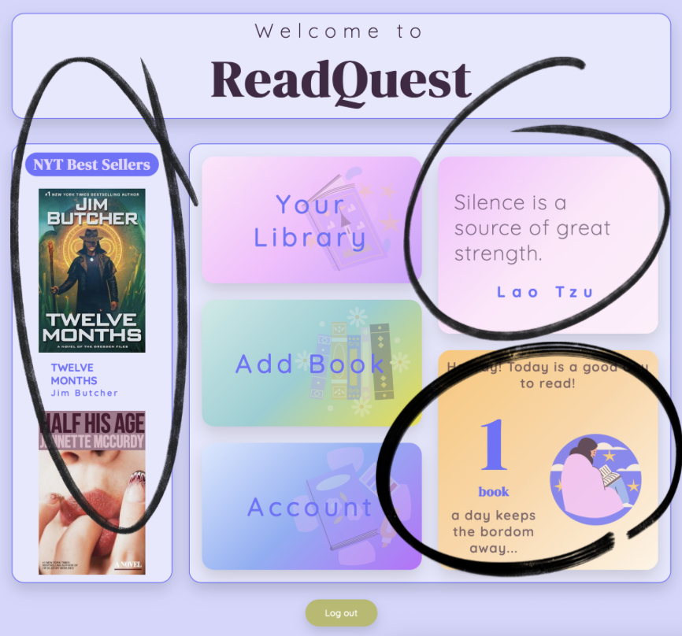
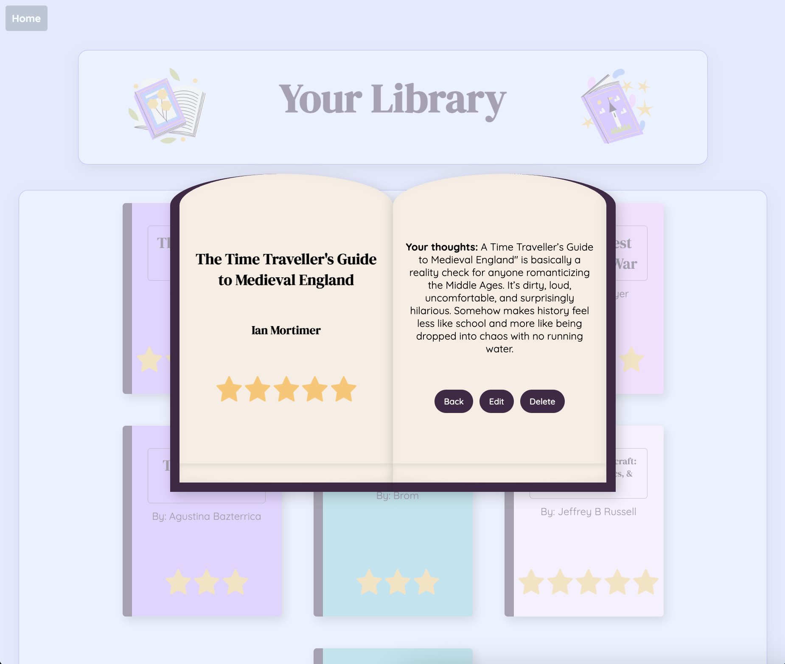

# ReadQuest: Store, rate, and review your reads

Full-stack application that lets users track and rate what they have read. Users can create an account and store books in their "book shelf" where they can view, edit, rate and delete books they have read.

## Purpose

ReadQuest is a full-stack app designed to practice integrating multiple third-party APIs and managing CRUD operations for users’ book collections.

## Key Features

- User authentication with JWT & cookies
- Personal bookshelf to create, edit, rate, and delete books (CRUD Application)
- NYT Top 10 Best Sellers integration
- Random daily reading quotes
- Weather-based reading suggestions
- Secure user-specific data storage

# APIs

## On the user's dashboard are three APIs:

- One which shows users the top 10 books according to the New York Times Bestsellers list.
- A second API which genertes a random quote.
- And a third API that gets the weather in their area and tells them what day it will be a good day to read (Example: Rainy day in 3 days, great time to read!).

## Image of APIs:

# Tech:

### Tech Stack

- **Frontend:** HTML, CSS, JavaScript
- **Backend:** Node.js, Express
- **Database:** MySQL
- **Authentication:** JWT & cookies
- **APIs:** NYT Bestsellers, NYT Daily Quote, Weather

### Other

- JWT Authenication and cookies
- CRUD application

# Extra Extra! Read all about it!

## View bookshelf:

## Create a book:

## View a book:

#### Options to edit, delete, or return to book shelf

